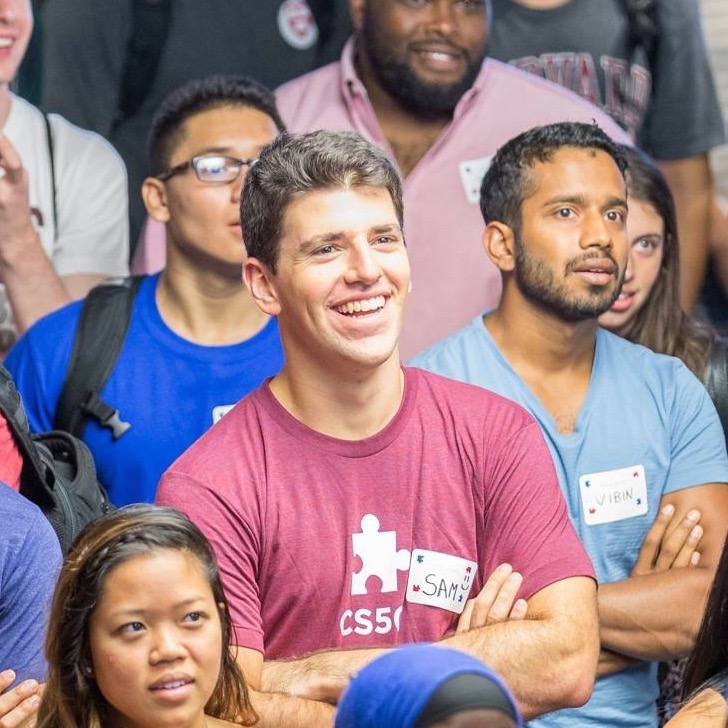

## About

I'm a Senior at Harvard College studying Computer Science. I'm writing a thesis
on [multi-agent markets](https://en.wikipedia.org/wiki/Two-sided_market) for indivisible goods with
[Prof. David Parkes](http://www.eecs.harvard.edu/~parkes/). I also help
[Prof. Stuart Shieber](http://eecs.harvard.edu/shieber/) teach [Computer Science 51: Abstraction and 
Design in Computation](http://cs51.io) along with [Gabbi Merz](http://gcmerz.github.io). 

#### Projects
<ul>

    <li> <a href="{{proj.link}}">{{proj.name }}</a> </li>

</ul>

